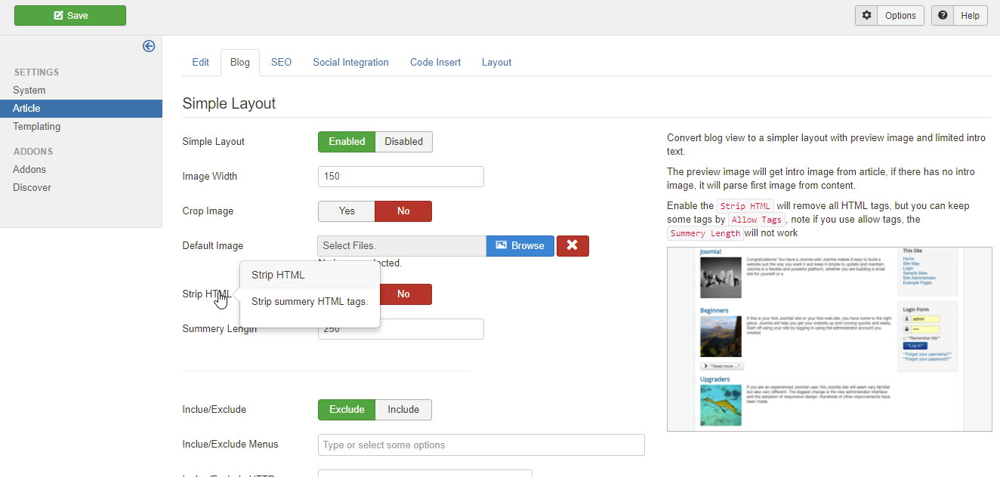

## Installation

You must purchase Ezset plan on Asikart official site. See http://asikart.co/ezset-plans.html

After purchased, just login and go to [Ezset Download Page](http://asikart.co/downloads/ezset.html) to download Ezset.

Then go to Joomla admin install it.

After installed, Ezset will create an `ezset` folder in Joomla root, it contains many useful files if you want to customize your site.

Now click the Ezset logo and you will go to Ezset admin.

## Concept

Ezset has many functions, these functions has been organizated in some addons. By default, you can see 3 addons, `system`, `article` and `templating`

Every addon has many tabs and fields, the fields is the setting that you can configure your site or provides some useful functions. You can see description when you hover the field label or read the help text at right side.

Ezset is extendable, it allows you to create your own addon and customize everything for your site or your client. Before you start writing your own addon, we recommend you read this document to learn how Ezset basic function works.

