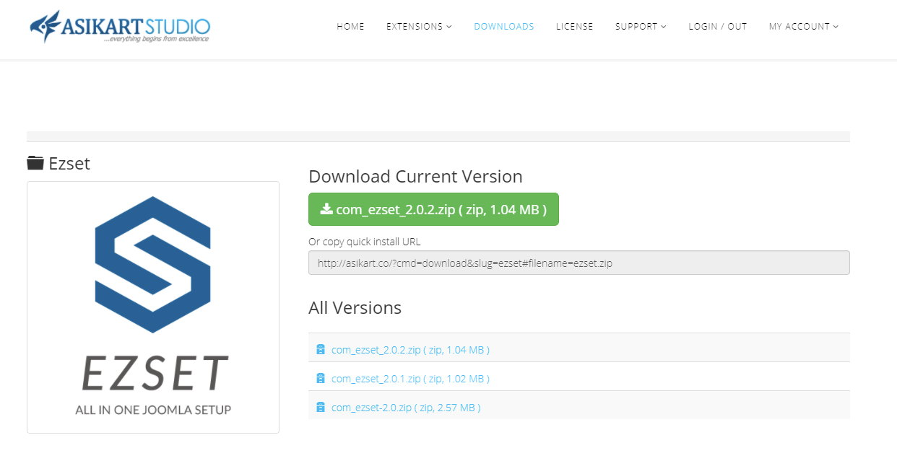
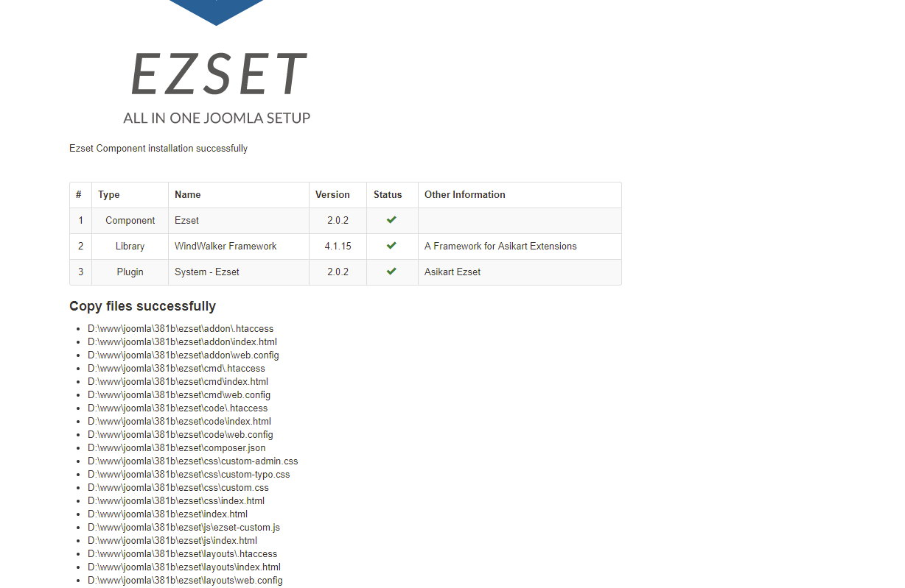

You must purchase Ezset plan on Asikart official site. See http://asikart.co/ezset-plans.html

After purchased, just login and go to [Ezset Download Page](http://asikart.co/downloads/ezset.html) to download Ezset.

Then go to Joomla admin install it.

After installed, Ezset will create an `ezset` folder in Joomla root, it contains many useful files if you want to customize your site.

Now click the Ezset logo and you will go to Ezset admin.