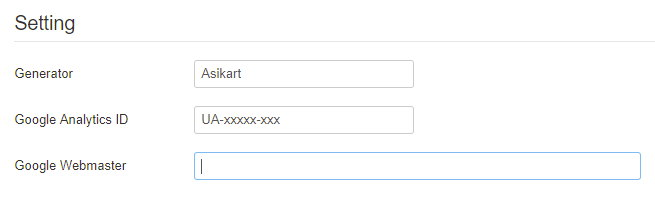
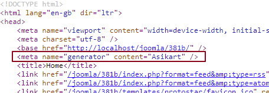
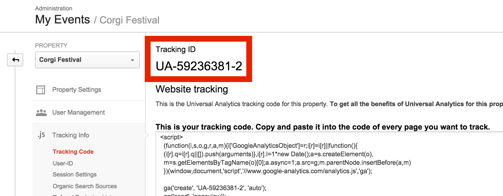
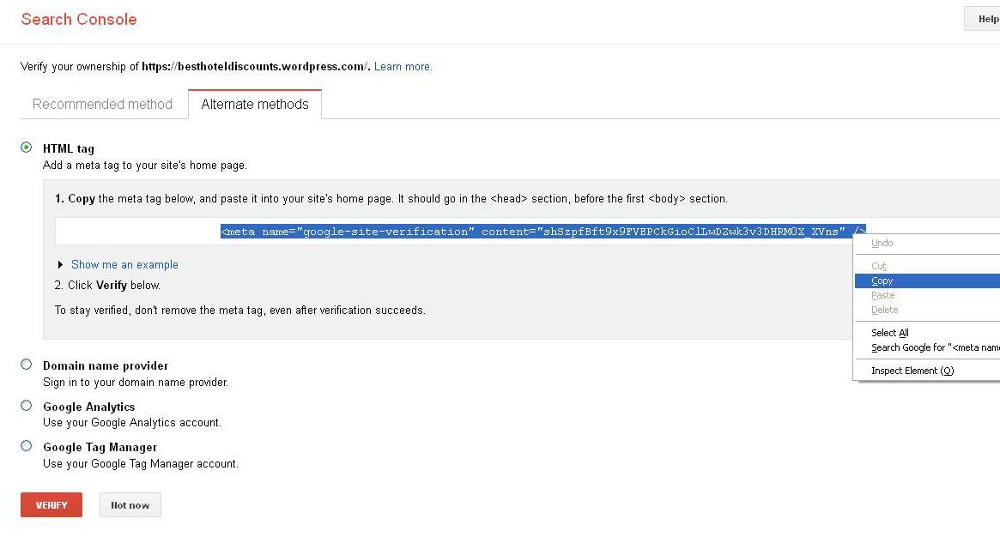

## Setting

Some basic setting of your site.

### Generator

This field can override the meta generator in HTML `<head>`.

### Google Analytics ID

Set [Google Analytics](https://analytics.google.com) ID here to track your site traffic. 

### Google Webmaster

If you submit your site to [Google Webmaster](https://www.google.com/webmasters) (Google Search Console), it will require you to verify domain owner. You can simply choose `HTML meta tag` option and paste the verify code to here. See [Google Search Console document](https://support.google.com/webmasters/answer/79812).

