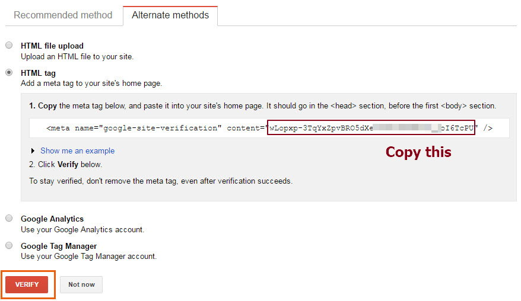
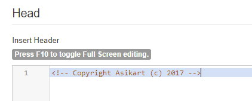
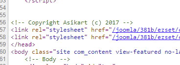
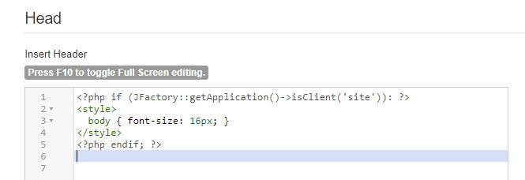

## Setting

Some basic setting of your site.

### Generator

This field can override the meta generator in HTML `<head>`.

### Google Analytics ID

Set [Google Analytics](https://analytics.google.com) ID here to track your site traffic. 

### Google Webmaster

If you submit your site to [Google Webmaster](https://www.google.com/webmasters) (Google Search Console), it will require you to verify domain owner. You can simply choose `HTML meta tag` option and paste the verify code to here. See [Google Search Console document](https://support.google.com/webmasters/answer/79812).

## Head

You can insert some custom code to HTML `<head>`.

For example, add a comment to mark copyright:

This field also able to use PHP, you can use Joomla API to make some logic. This example add a style tag only for frontend.

> **NOTE** The content you write here will appear in both site and admin, do not use this field to insert Google Analytics or some frontend analysis code. Otherwise you must limit the application client by PHP yourself.
