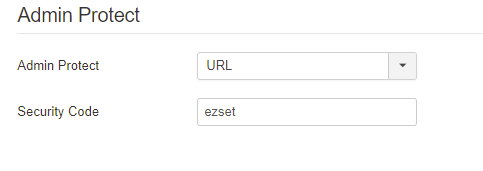
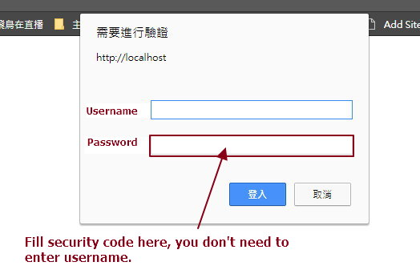
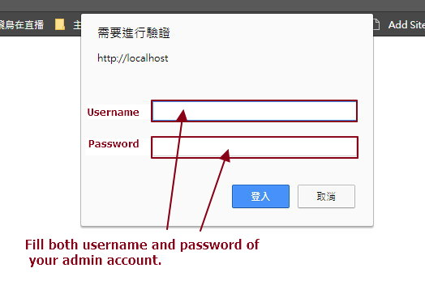
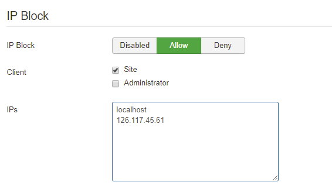
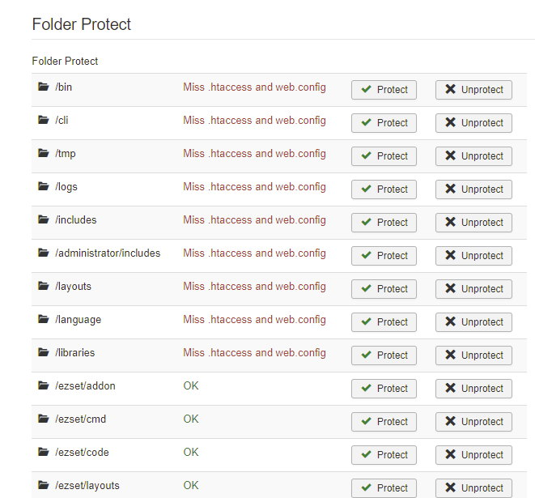

## Admin Protect

This function helps you protect your administrator to get rid of direct access. There are 3 options you can choose:

### URL

The option must add the security code after admin URL, for example, if you set Security Code as `ezset`, you must use `/administrator?ezset` to access your admin, otherwise Ezset will redirect you back to frontend.

### HTTP Auth

Use Apache HTTP authentication popup, you must enter security code at password field then you can access admin.

### HTTP Auth and User Credential

This option will not use security code, you must enter your username and password at HTTP auth popup, then you will directly logged-in.

## IP Block

Simple IP block function to help you allow or deny IP to access your site.

Choose `Allow` to only allow IPs you set to access your site and block all users. Or choose `Deny` to allow all access except the IPs you set.

You can select `site` and `administrator` checkboxes to enable this function on particular client.

> Currently we dont't support wildcards (`*`), so you must add an IP per line.

## Folder Protect

Joomla's folders and files are exposure on webroot, so everyone who knows you use Joomla can guess and try access some sensitive files or dirs. 

For example, if some 3rd extensions add text logs to `logs` folder, it can be opened by browser if someone is familiar to this extension. Another case is that if hacker inject trojan code to Joomla files, they can execute any commands from remote. This function can also protect your site from remote attack.

Ezset can auto add `.htaccess` (Apache) and `web.config` (IIS) to protect your dir and files to prevent direct access. Just click these buttons. You can also remove protects at any time if you want.