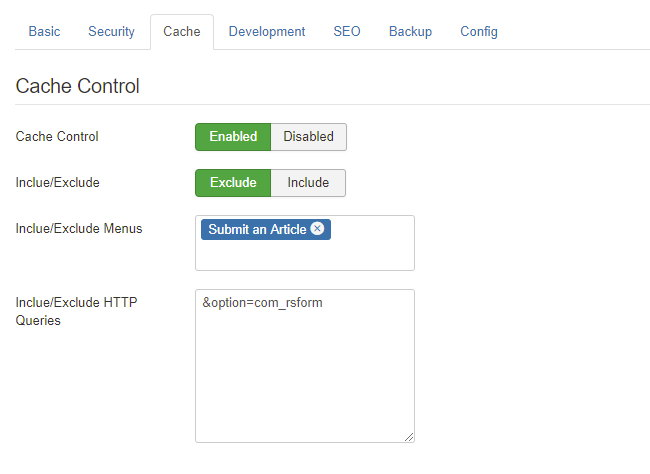

Ezset Cache management can control Joomla [System - Page Cache](https://docs.joomla.org/Cache#Page_Caching) plugin enable and disable in particular pages.

By default, if you enabled `System - Page Cache` plugin, it will work on every pages of your site and cache whole page as pure HTML, but it will make some extensions not work, for instance, if you have a contact form and you hope customer can write some message to you, page cache plugin will make this form unsubmitable.

You must enable this function first, and choose `include` or `exclude`. `Exclude` can make the menus you choose or the page matches HTTP query to disable cache. And `Include` will enable cache plugin only on thess pages.

### How to Set HTTP Query

Use `key=value` to set HTTP query conditions.

> `option=com_zoo`: This will work for whole zoo component.

Ezset allows you use `!=` as negative compare.

> `option=com_contact&view!=complete`: This will work for Contact component without complete view.