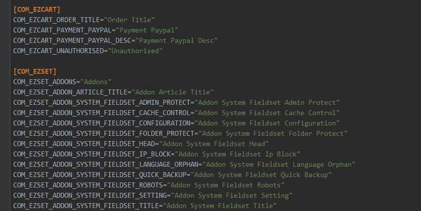

## Language Orphan

This function will auto log all untranslated language keys to as file so that you can collect them to translate. The logged key will look like: `COM_XXX_FOO_BAR="Foo Bar"`, you can set strip prefixes to remove the key prefix.

You must enable [Debug Language](https://docs.joomla.org/Debugging_a_translation) in [Joomla global configuration](https://docs.joomla.org/J3.x:Global_configuration#Debug_Settings_Group) first.

After enable this fuction and **Debug Language** config, go to browse all pages with untranslated languages, all language keys will log in `logs/languages.ini`, just copy it to your language file and translate it.

