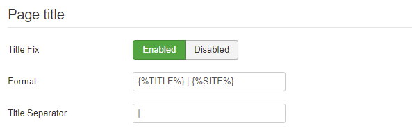

This tab is to configure SEO for whole site. The settings about [Article SEO] please go to Article Addon.

## Page Title



This function can replace Joomla core [Add Site Name To Page Titles](https://docs.joomla.org/J3.x:Global_configuration#SEO_Settings_Group) settings. It is more flexiable and configurable that you can customize the title format. 

The most important thing is that Joomla's core page title at home page will be `Home - Sitename`. But Ezset will only keep `Sitename` at home page and remove unnecessary page title.

### Format

Set the title format you wish. Use `|` to separate variables, there are 3 variables available now.

- `` => Page title
- `` => Category title (if has category ID in this page)
- `` => Site name

### Title Separator

Default is `|`, this will replace the `|` chatacters in **Title Format** field. If you set ` | ` in **Title Format** and `-` in **Title Separator**, your title will be `Title - Sitename`.

## Robots

Google will ignore css, js and image files if they are in the folders which robots.txt disallowed, this function will remove some folders from robots.txt so Google can index necessary media files.

See [this article](https://joomlaseo.com/checklist/robots-txt-for-search-engines).

The new robots.txt will looks like:

```
User-agent: *
Disallow: /administrator/
Disallow: /bin/
# Disallow: /cache/
Disallow: /cli/
# Disallow: /components/
Disallow: /includes/
Disallow: /installation/
Disallow: /language/
Disallow: /layout/
# Disallow: /libraries/
Disallow: /logs/
# Disallow: /modules/
# Disallow: /plugins/
Disallow: /tmp/
```


