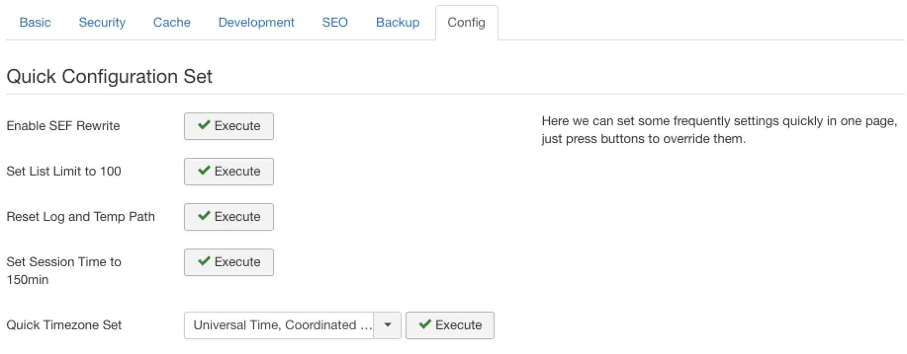

## Quick Configuration Set

This function can quick set some useful settings to your global configuration, just click the button to process it.

### Enable SEF Rewrite

Enable SEF rewrite to remove `index.php` from URL and auto rename `htaccess.txt` to `.htaccess`.

### Set List Limit to 100

Set `List Limit`, `Feed Limit` to 100.

### Reset Log and Temp Path

Reset `/logs` and `/tmp` path to root, if you have migrated your site to new path, this function is useful to fix the absolute path.

### Set Session Time to 150min

Set session lifetime to 150 minutes to make you can operate admin for longer time.

### Quick Timezone Set

Set timezone of your site.
