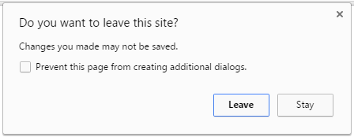
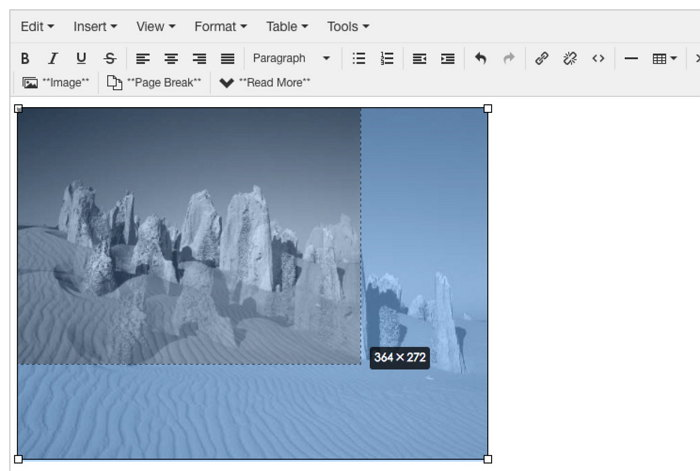

`Editing` section provides some useful function to help admin user when they are editing articles.

## Tidy Repair

Use tidy to repaire article body. Simetimes the Joomla readmore line, whish is a `
` tag, may break an existing HTML tag and make article layout broken. Enable `Tidy Repair` function that Ezset will try to repair HTML tags.

> If `php_tidy` extension is unable to use, Ezset will use a native HTML repair function instead.

## Confirm Leave

This function will show a confirm popup if user want to leave or close page when editing article.

## Save First Image

Save the first image URL in article content to the intro image field. This is useful if you used some news module which will load the intro image as preview image.

## Image Resize

If you insert big images to article, you can resize them by mouse in editor, then Ezset will help you generate thumbnails for these images. See example below:

