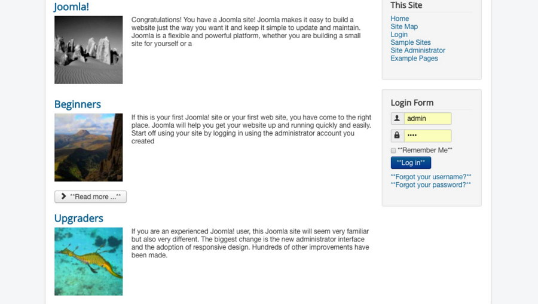

## Simple Layout

Convert blog view to a simpler layout with preview image and limited intro text.

The preview image will get intro image from article, if there has no intro image, it will parse first image from content.

### Image Width & Crop Image

The Width of preview image. If you set `Crop Image` to **YES**, the preview image will be square and generate a thumbnail, otherwise the image will fixed width and make height auto.

### Default Image

If article can not find any preview image, a default image will show instead. You can also set your own default image.

### Strip HTML & Summery Length

Enable the `Strip HTML` will remove all HTML tags, but you can keep some tags by `Allow Tags`, note if you use allow tags, the `Summery Length` will not work

### Include / Exculde

You can set include / exclude menus or HTTP query to enable Simple Blog layout in particular pages.

The HTTP query conditions example:

- `option=com_zoo` --> match the `com_zoo` all pages.
- `option=com_content&view!=feature` --> Match com_content all pages but not in featured view.