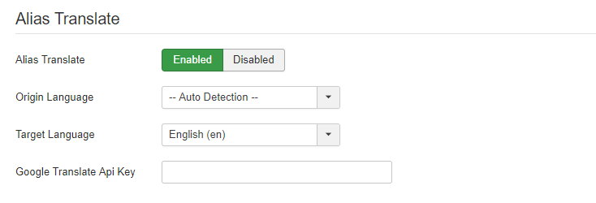

This tab has some functions help you do auto SEO settings.

## Sitemap

Render a XML sitemap for Joomla articles and menus only. Enable this function and type `?cmd=sitemap` after your site URL, for example: `http://mysite.com/?cmd=sitemap`.

It can be a simple & fast way to help you submit Sitemap to Google Webmaster. If you want to integrate more 3rd party extensions to sitemap, please consider other sitemap extensions in [JED](https://extensions.joomla.org/category/structure-a-navigation/site-map/).

## Alias Translate

Sometimes non-english user will write an article title with their native language, if Joomla can not get any alphanum letters from title, the alias will be time string like `2017-03-02-02-59-00`.

This is not good for SEO, so Ezset can use Google translate API to help you translate alias if you are not fill alias field.

Note this function will work on all components and menus if they save data with `jform[title]` and `jform[alias]`.

> You must use your own Google translate API, we will provide a service without API key in the future.

The `Origin Language` will be translate to `Target Language`, by default it is `Auto detection`, but we suggest you choose your own language.

- [Get Google API Key](https://cloud.google.com/translate/docs/getting-started#set_up_your_project)
- [How to create Google API key](https://docs.simplecalendar.io/google-api-key/)
- [Obtain A Google Translate API Key](https://atrilsolutions.zendesk.com/hc/en-us/articles/205540421-How-to-obtain-a-Google-Translate-API-key)

## SEO Metadata

Enable this function, Ezset will auto get article introtext as meta description if user didn't fill meta description field.
